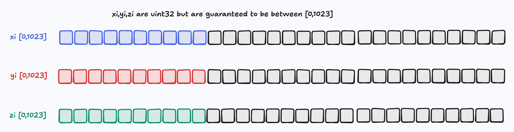
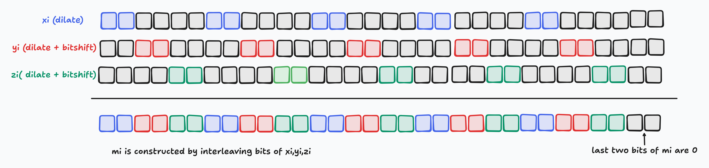
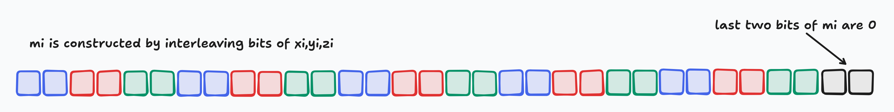
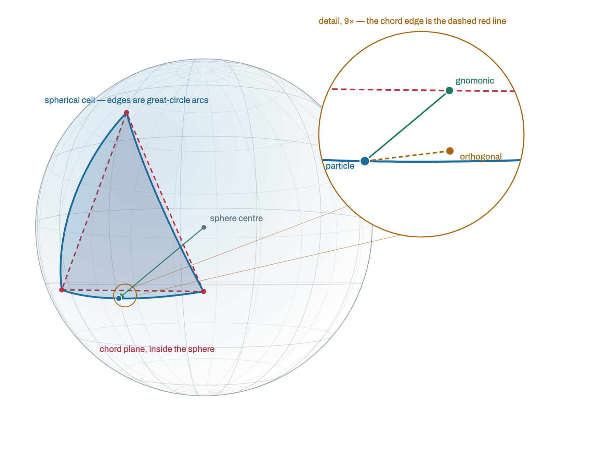

# Unstructured and Curvilinear Grid Search

This page documents the algorithm used in Parcels to locate which grid cell a particle occupies on both curvilinear (`XGrid`) and unstructured (`UxGrid`) grids.

On a rectilinear grid, finding which cell contains a particle is a trivial O(1) operation. We can compute an index from the coordinate directly. For example, a rectilinear grid has $x$ and $y$ coordinates

```
x_i = x_0 + i*dx
y_i = y_0 + j*dy
```

where `dx` and `dy` are the constant grid spacing in the $x$ and $y$ directions, $(x_0,y_0)$ is the coordinate of the lower left corner of the domain, and $(i,j)$ are the zero-based indices corresponding to the lower left corner of a face in the grid. Note that a **face** in Parcels (also referred to as an **element**) is defined by its four corner vertices; here, face $(i,j)$ has corner nodes $(x_{i+m},y_{j+n})|_{(m,n)=[0,1]}$. Given a particle at position $(x_p,y_p)$, computing the corresponding face indices is a quick calculation

```
i = floor( (x_p - x_0)/dx )
j = floor( (y_p - y_0)/dy )
```

On curvilinear and unstructured grids, no such shortcut exists; each cell has an arbitrary shape and position. A naive approach for particle search in these cases is to pick an element, perform a particle-in-cell check, and iterate until the particle is found. In this naive approach, the search cost scales with the size of the grid; for N elements the naive search is O(N). The particle-in-cell check is unavoidable for gauranteeing that a particle is indeed within a face. Thus, particle search algorithms for curvilinear and unstructured grids are focused on reducing the number of candidate elements to search within. Commonly used KD-trees, BVH trees, and quad-trees use hierachical descriptions for a mesh that reduce the search to O( log N ) complexity.

In Parcels, we opt for **spatial hashing**, which relates the elements of a curvilinear grid or unstructured grid to the elements of an underlying rectilinear "hash grid". To search for a particle on these more complex grids, we first compute the particle indices on the hash grid. In turn, those indices can be used to quickly look up a short list of candidate elements to perform and particle-in-cell check on. The lookup table that relates the hash grid indices to the candidate elements in the parent grid is called the "hash table".

Within Parcels, we have made strategic choices that define

- the resolution and extents of the underlying hash grid as a function of the parent curvilinear or unstructured grid
- the relationship between candidate parent grid elements and the hash grid elements (the hash table),
- the data structures used to store and lookup entries in the hash table, and
- the particle-in-cell methods used for determining whether a particle is in or out of a curvilinear or unstructured grid element.

In the implementation that exists in v4, we have made numerous refinements to optimize initialization speed, memory consumption, and query speed. This documentation provides details for developers and enthusiastic Parcels users that dive into the specifics of the hash table construction, morton encoding, the particle search (query) method, and particle-in-cell checks. The aim here is to convey clearly what the code is designed to do and why.

For reference, the implementation in code lives in two files:

- `src/parcels/_core/spatialhash.py` — `SpatialHash` class and Morton encoding utilities
- `src/parcels/_core/index_search.py` — point-in-cell tests and the high-level search dispatch

---

## Algorithm

The spatial hash is used in two phases. The **construction** phase runs once per grid, the first time a particle search is requested on it; `get_spatial_hash()` builds the `SpatialHash` lazily and caches it on the grid object, so all subsequent searches reuse the same hash table. The **query** phase runs every time a set of particles must be located, which in practice means every time a field is interpolated onto particle positions during `pset.execute`. Because queries vastly outnumber constructions, we are willing to spend some effort during construction if it makes queries cheaper, as long as the memory required to build and hold the hash table stays bounded.

### Hash table construction

Constructing the hash table amounts to answering one question for every face in the parent grid: which hash grid cells does this face overlap? We answer this conservatively, using the axis-aligned bounding box of each face rather than the face itself. A face is registered in every hash cell that its bounding box touches. This can register a face in a few hash cells that it does not actually overlap, but it never misses a hash cell that it does overlap. Missing an overlap would mean a particle could never be found in that face; an extra overlap only adds a candidate that the particle-in-cell check will reject.

Construction proceeds in the following steps, which are the same for curvilinear and unstructured grids:

1. Compute the bounding box $[x_{low}, x_{high}] \times [y_{low}, y_{high}] \times [z_{low}, z_{high}]$ of every face in the parent grid.
2. Set the extents of the hash grid to the bounding box of all of the faces combined.
3. Choose the resolution of the hash grid so that the hash table stays within a fixed memory budget.
4. Quantize the corners of each face's bounding box onto the hash grid, and generate one Morton code for every hash cell within that box.
5. Sort the (Morton code, face) pairs and compress them into the hash table.

Steps 1 and 2 are where curvilinear and unstructured grids differ, and where flat and spherical meshes differ. We describe them for each grid type first, and then describe steps 3–5, which are shared.

The hash grid is always three dimensional, regardless of the parent grid. The coordinates used for each combination of grid and mesh type are

| Parent grid | Mesh type | Hash grid coordinates                     |
| ----------- | --------- | ----------------------------------------- |
| `XGrid`     | flat      | $(x, y, z) = (\text{lon}, \text{lat}, 0)$ |
| `XGrid`     | spherical | Cartesian $(x, y, z)$ on the unit sphere  |
| `UxGrid`    | flat      | $(x, y, z) = (\text{lon}, \text{lat}, 0)$ |
| `UxGrid`    | spherical | Cartesian $(x, y, z)$ on the unit sphere  |

On spherical meshes, node longitudes and latitudes are converted from degrees to radians and then to Cartesian coordinates on the unit sphere with `_latlon_rad_to_xyz`

```
x = cos(lon) * cos(lat)
y = sin(lon) * cos(lat)
z = sin(lat)
```

We hash in Cartesian space on the sphere for two reasons. First, longitude is discontinuous at the antimeridian; a face straddling $\pm 180^\circ$ would have a longitude bounding box that spans nearly the entire domain, registering it in a huge number of hash cells. In Cartesian space, that same face has a small bounding box. Second, lon/lat faces near the poles are highly elongated in lon/lat space, even though they are not on the sphere. In Cartesian space, faces of similar physical size have bounding boxes of similar size, so the hash grid resolution is spent more evenly across the mesh.

#### Curvilinear grids

On a curvilinear grid (`XGrid`), the face $(j,i)$ is defined by the four corner nodes `[j,i]`, `[j,i+1]`, `[j+1,i+1]`, and `[j+1,i]`, wound counter-clockwise around the face. The bounding boxes of all faces are computed at once by stacking these four corner arrays and reducing over the corner axis, so the bounding box arrays have shape `(ny-1, nx-1)`, the same shape as the faces of the grid.

On a **flat** mesh, the edges of a face are straight lines in (lon, lat), so the bounding box of a face is simply the minimum and maximum of its corner longitudes and latitudes. The extents of the hash grid are the minimum and maximum of the grid longitudes and latitudes, and $z$ is fixed at zero.

On a **spherical** mesh, the edges of a face are great-circle arcs, and the face can bulge beyond the extents of its corner nodes (see [Face bounds on the sphere](#face-bounds-on-the-sphere) below). The corner nodes are converted to Cartesian coordinates, and the bounding box of each face is computed with `_spherical_face_bounds`. The extents of the hash grid are then the minimum and maximum of the face bounds. For a global grid, this is (nearly) the unit cube $[-1,1]^3$. For a regional grid, it is much tighter, which means the full resolution of the hash grid is spent on the region that is actually covered by the parent grid rather than on the whole sphere.

Curvilinear grids from ocean models occasionally contain faces that are not fully defined, for example land points whose lon/lat are masked to `0.0`. A face with one such corner node can stretch across a large portion of the domain and, on its own, overlap a large number of hash cells. On spherical curvilinear grids, we detect these with `_find_degenerate_xgrid_faces`, which computes the longest great-circle chord across the four edges and two diagonals of each face, and flags a face as degenerate if that chord is more than `threshold_factor` (default 10) times the 99th percentile of all faces. When degenerate faces are found, a `FieldSetWarning` reports how many there are and the `(j, i)` location of the first few, since these faces can cause high memory usage in the hash table and cell lookup failures for nearby particles.

#### Unstructured grids

On an unstructured grid (`UxGrid`), the nodes of each face are given by `face_node_connectivity`, which has shape `(nfaces, n_max_face_nodes)`. The node coordinates are gathered with this connectivity to give an array of shape `(nfaces, n_max_face_nodes)` per coordinate, and bounding boxes are computed by reducing over the node axis.

As with curvilinear grids, on a **flat** mesh the bounding box of a face is the minimum and maximum of its node longitudes and latitudes, and the extents of the hash grid are the minimum and maximum of `node_lon` and `node_lat`. On a **spherical** mesh, the nodes are converted to Cartesian coordinates, the bounding box of each face is computed with `_spherical_face_bounds`, and the extents of the hash grid are the minimum and maximum of the face bounds.

Unstructured grids have a single face index rather than a $(j,i)$ pair. So that the rest of the construction and query code can treat both grid types the same way, the bounding box arrays for a `UxGrid` are reshaped to `(1, nfaces)` with `np.atleast_2d`. Every face then has $j=0$ and $i$ equal to its face index. There is currently no degenerate face detection for unstructured grids.

#### Face bounds on the sphere

**Function:** `parcels._core.spatialhash._spherical_face_bounds`

Whenever a mesh is "spherical", a cell's edges are arcs of great circles on the sphere that the mesh sits on. Therefore, the face itself is a curved patch that bulges away from the flat polygon through its nodes. The extremes of $x$, $y$ and $z$ reached anywhere on that patch must be taken as the bounds for the hash grid; if we used the node coordinates alone, a particle sitting in the bulge of a face could land in a hash cell that the face is not registered in, and the particle would never be found.

`_spherical_face_bounds` computes these minima and maxima for each face in closed form, without sampling points along the face. On a convex spherical face, a coordinate's extreme can only sit in one of three places, so we take the most extreme candidate from each:

1. **At a node.** The `np.min`/`np.max` over the face's nodes.

2. **At one of the unit sphere's six axis points.** $(\pm1, 0, 0)$, $(0, \pm1, 0)$ and $(0, 0, \pm1)$ are where $x$, $y$ and $z$ reach their global extremes on the unit sphere. A face that contains one of them attains $\pm1$ exactly, so that bound is set directly rather than searched for. A point $p$ lies inside the spherical triangle spanned by nodes $v_0, v_1, v_2$ exactly when it is a non-negative combination of them, so we solve $Mw = p$ with the nodes as the columns of $M$ and ask whether every $w_i \ge 0$. That solve needs exactly three nodes, so a face with more than three nodes (e.g. every face of a curvilinear grid) is first split into a fan of triangles about its first node; a point inside any of those triangles is considered to be in the face. Triangles with no area are skipped rather than passed to `np.linalg.solve`.

3. **Partway along an edge.** To compute minima and maxima along edges, we parameterise the edge as a cosine, and then analytically compute whether that cosine hits a minimum or maximum within the part of the arc the edge comprises. Let $\hat u$ be the unit vector perpendicular to node $a$ pointing towards node $b$. Every point of that edge is then $a\cos\theta + \hat u \sin\theta$ for $\theta \in [0, \delta]$, with $\delta$ the angular length of the arc. Each coordinate along the edge is therefore a sinusoid, $A\cos\theta + B\sin\theta = R\cos(\theta - \varphi)$ with amplitude $R = \sqrt{A^2 + B^2}$ and phase $\varphi = \mathrm{atan2}(B, A)$. Its maximum $+R$ falls at $\theta = \varphi$ and its minimum $-R$ at $\theta = \varphi + \pi$, as long as those min/max occur when $\theta$ is within $[0, \delta]$. If the min/max for $\theta$ do not fall within $[0, \delta]$, then the edge's min/max is at a node, which is already accounted for above.

### Hash grid resolution

The resolution of the hash grid is set by the quantization `bitwidth`, which is the largest integer index along each axis of the hash grid. With `bitwidth = 1023`, each axis of the hash grid is divided into 1024 cells, giving a $1024 \times 1024 \times 1024$ hash grid. The value 1023 is the maximum we allow, since it fits in 10 bits, and three 10-bit indices fit in a single 32-bit Morton code (see [Morton encoding](#morton-encoding)).

The choice of resolution is a trade-off between query cost and memory. A finer hash grid has smaller hash cells, so fewer faces are registered in each hash cell, and a query has fewer candidates to perform particle-in-cell checks on. However, each face's bounding box then overlaps more hash cells, and since the hash table holds one entry per (face, hash cell) overlap, the table grows. Because a face's bounding box is three dimensional, halving the size of the hash cells can increase the number of entries for a face by up to a factor of eight. On a grid with widely varying face sizes, the largest faces can dominate the size of the hash table.

To keep this bounded, we cap the total number of entries in the hash table with a budget that scales with the number of faces in the parent grid

```
budget = max(_HASH_ENTRIES_PER_FACE * nfaces, _HASH_ENTRY_BUDGET_MIN)
```

with `_HASH_ENTRIES_PER_FACE = 16` and `_HASH_ENTRY_BUDGET_MIN = 2**22`. The per-face target of 16 is chosen to keep the number of particle-in-cell checks per query small, while keeping the memory footprint of the construction manageable. The floor of $2^{22}$ entries keeps small grids from being forced onto an unnecessarily coarse hash grid, since the memory for a table of that size is negligible.

The construction starts at `bitwidth = 1023`. `_total_hash_entries(bitwidth)` computes how many entries the hash table _would_ have at a given resolution by quantizing the corners of every face's bounding box and summing $n_x n_y n_z$ over all faces, without generating any of the entries. If the table at `bitwidth = 1023` fits within the budget, that resolution is kept. Otherwise, we binary search for the largest `bitwidth` in $[1, 1023]$ whose table fits within the budget. The number of entries is not perfectly monotone in `bitwidth` (because of where cell boundaries happen to fall relative to face bounds), so the search may land marginally below the true largest `bitwidth` that fits. This is fine, since any `bitwidth` that fits the budget is valid. The search always terminates at a valid resolution: at `bitwidth = 1` each face overlaps at most two hash cells per axis, so the table holds at most `8 * nfaces` entries, which is always within the budget.

Faces with a `NaN` anywhere in their bounding box (a node with a missing coordinate) are excluded from the hash table. They contribute zero entries to the budget and are never registered in any hash cell.

### Morton encoding

To store and look up entries in the hash table, each hash cell needs a key. The hash cell $(x_q, y_q, z_q)$ could be flattened into a single index with a row-major formula, but we instead use a **Morton code** (also called a Z-order code), formed by interleaving the bits of $x_q$, $y_q$, and $z_q$. Morton codes preserve spatial locality: hash cells that are close together in 3-D generally have Morton codes that are close together. Since the hash table is sorted by key, the entries for neighbouring hash cells sit close together in memory, which is what particles that are close together in space will look up.

The Morton code for a point is computed in three steps.

#### Quantization

**Function:** `parcels._core.spatialhash.quantize_coordinates`

Quantization maps a coordinate onto the index of the hash cell that contains it. Each coordinate is normalized to $[0,1]$ over the extents of the hash grid, scaled by `bitwidth`, clipped to $[0, \text{bitwidth}]$, and truncated to an integer

```
xq = floor( clip( (x - xmin)/(xmax - xmin) * bitwidth, 0, bitwidth ) )
```

and similarly for $y$ and $z$. This is the same calculation as finding a face on the rectilinear grid in the introduction; the hash grid _is_ a rectilinear grid, with lower left corner $(x_{min}, y_{min}, z_{min})$ and spacing $(x_{max} - x_{min})/\text{bitwidth}$.

There are two details worth noting here. First, clipping happens in floating point, before the cast to `uint32`. A particle outside of a regional domain has a negative normalized coordinate, which would wrap around to a very large integer if it were cast to `uint32` first. With the clip, a particle outside of the domain is assigned to a hash cell on the boundary of the hash grid, and the particle-in-cell checks on that cell's candidates correctly report that it is not found. Second, when an axis has zero extent (e.g. $z$ on a flat mesh, where $z_{min} = z_{max} = 0$), the normalized coordinate is set to zero rather than dividing by zero.



_The quantized coordinates $x_q$, $y_q$, and $z_q$ are stored as `uint32`, but are guaranteed to lie in $[0, 1023]$, so only their lowest 10 bits are used._

#### Bit dilation

**Function:** `parcels._core.spatialhash._dilate_bits`

Before interleaving, each 10-bit quantized coordinate is "dilated" so that its bits are spread out with two zero bits between each of them

```
Input:  b9 b8 b7 b6 b5 b4 b3 b2 b1 b0
Output: b9 0 0 b8 0 0 b7 0 0 ... b1 0 0 b0
```

Rather than looping over bits, this is done with a sequence of shift-and-mask operations on `uint32` values

```python
n &= 0x000003FF          # keep only 10 bits
n = (n | (n << 16)) & 0xFF0000FF
n = (n | (n <<  8)) & 0x0300F00F
n = (n | (n <<  4)) & 0x030C30C3
n = (n | (n <<  2)) & 0x09249249
```

Each stage copies the bits to the left by a decreasing amount and masks away the copies that are not wanted, moving groups of bits further apart. After the final stage, the 10 bits of the input sit at bit positions 0, 3, 6, ..., 27 of the result. These operations are vectorized over NumPy arrays, so all quantized coordinates are dilated at once.

#### Bit interleaving

**Function:** `parcels._core.spatialhash._encode_quantized_morton3d`

Once all three coordinates are dilated, the $y$ and $z$ results are shifted left by one and two bits, respectively, so that the three dilated coordinates occupy disjoint bit positions. The Morton code is then formed by OR-ing them together

```python
code = (dz << 2) | (dy << 1) | dx
```

The resulting bit layout, starting from the least significant bit, is

```
x0, y0, z0, x1, y1, z1, ..., x9, y9, z9
```

which uses 30 of the 32 bits in a `uint32`; the two most significant bits are always zero.



_$x_q$ is dilated, while $y_q$ and $z_q$ are dilated and then shifted by one and two bits, so that their bits do not overlap._



_The Morton code is constructed by interleaving the bits of $x_q$, $y_q$, and $z_q$. Only 30 bits are used, so the remaining two bits of the code are zero._

`_encode_morton3d` chains all three steps (quantize, dilate, interleave) together, and is the function used to encode particle positions during queries. During construction, the quantized coordinates of each hash cell are already known, so `_encode_quantized_morton3d` is called on them directly.

### Building the hash table

**Method:** `parcels._core.spatialhash.SpatialHash._initialize_hash_table`

With the resolution chosen, the corners $(x_{low}, y_{low}, z_{low})$ and $(x_{high}, y_{high}, z_{high})$ of every face's bounding box are quantized. Face $f$ then overlaps a block of $n_x \times n_y \times n_z$ hash cells, where

```
nx = xq_high - xq_low + 1
ny = yq_high - yq_low + 1
nz = zq_high - zq_low + 1
```

and contributes $n_x n_y n_z$ entries to the hash table. The total number of entries is the sum over all faces.

**Generating entries.** All entries are generated at once, with no Python loop over faces. Entries are laid out in face-major order: `face_ids = np.repeat(arange(nfaces), nx*ny*nz)` gives the face that each entry belongs to, and a counter `intra` enumerates the hash cells within each face's block, from $0$ to $n_x n_y n_z - 1$. The offset of each entry within its face's block is recovered from `intra` as

```
xi = intra // (ny*nz)
yi = (intra % (ny*nz)) // nz
zi = (intra % (ny*nz)) % nz
```

and adding the quantized lower corner of the face gives the hash cell $(x_q, y_q, z_q)$ of each entry. The Morton code of every entry is then computed with `_encode_quantized_morton3d`. The index arrays are `int32` unless the total number of entries exceeds what `int32` can hold, in which case `int64` is used. Intermediate arrays are deleted as soon as they are no longer needed, to keep the peak memory of the construction down.

**Sorting.** To look up the faces registered in a hash cell, entries must be grouped by Morton code, which means sorting them. Sorting with `np.argsort` and then gathering both the codes and the face ids with the resulting permutation would require three additional arrays the size of the hash table. Instead, since both the Morton code and the face id fit in 32 bits, we fuse each pair into a single `uint64`, with the Morton code in the upper 32 bits and the face id in the lower 32 bits

```python
packed = (morton_code.astype(np.uint64) << 32) | face_id
packed.sort()
```

Sorting the fused values as unsigned integers orders the entries by Morton code, with ties broken by ascending face id, and is done in place. Afterwards, the face ids are recovered by truncating `packed` to `uint32` (keeping the lower 32 bits), and the Morton codes are recovered by shifting `packed` right by 32 bits.

**Compressing.** The sorted entries are stored in a Compressed Sparse Row (CSR) layout. Each unique Morton code is a row of the table, and the faces registered in that hash cell are the non-zero entries of the row. Rather than calling `np.unique`, the start of each row is found by comparing each sorted Morton code to its neighbour. The hash table consists of four arrays

| Array    | Description                                                                              |
| -------- | ---------------------------------------------------------------------------------------- |
| `keys`   | The sorted, unique Morton codes of the hash cells that have at least one face registered |
| `starts` | The index into `faces` where the entries for each key begin                              |
| `counts` | The number of faces registered for each key                                              |
| `faces`  | The flat (raveled) face id of every entry, in sorted order                               |

Only hash cells that overlap at least one face are stored, so empty regions of the hash grid (e.g. the interior of the unit cube on a spherical mesh) cost no memory. For each entry, we store only the flat face id (4 bytes), rather than precomputed $(j,i)$ pairs, which would require two `int64` arrays (16 bytes per entry) held for the lifetime of the grid. The $(j,i)$ pairs are recovered during a query, only for the faces that are actually gathered as candidates.

### Querying the hash table

**Method:** `parcels._core.spatialhash.SpatialHash.query`

Given arrays of particle latitudes `y` and longitudes `x` (in degrees), a query returns the face containing each particle, along with the particle's local coordinates within that face. All particles are processed together, with no Python loop over particles.

1. **Convert to hash grid coordinates.** On a spherical mesh, the particle positions are converted to Cartesian coordinates. On a flat mesh, the longitudes and latitudes are used directly, with $z = 0$.

2. **Encode.** The Morton code of each particle is computed with `_encode_morton3d`, using the same extents and `bitwidth` that were used to build the hash table.

3. **Look up.** Since `keys` is sorted, the row of each particle's Morton code is found with a binary search, `np.searchsorted(keys, query_codes)`. `searchsorted` returns the position where a code _would_ be inserted, so a particle only has candidates if the key at that position exactly matches its Morton code, and if its coordinates are finite. Particles in a hash cell with no registered faces have no candidates.

4. **Gather candidates.** For each particle with a match, its candidate faces are `faces[starts[pos] : starts[pos] + counts[pos]]`. These slices are gathered for all particles at once using `np.repeat` and cumulative sums over `counts`, giving flat arrays of (particle, candidate face) pairs. The gathered face ids are then unravelled to $(j, i)$ with `np.unravel_index`. For unstructured grids, whose bounding boxes were reshaped to `(1, nfaces)`, this gives $j = 0$ and $i$ equal to the face index.

5. **Particle-in-cell checks.** The particle-in-cell check for the grid type (see below) is called once on all (particle, candidate face) pairs. For each particle, the first candidate that contains the particle is selected; since candidates are sorted by ascending face id within each key, this is the lowest-numbered face containing the particle.

6. **Return.** The query returns `(j, i, coords)`. For particles that are not found in any face, $j$ and $i$ are set to `GRID_SEARCH_ERROR = -3` and the local coordinates are set to $-1$.

The cost of a query is a binary search over `keys`, which is $O(\log K)$ in the number of occupied hash cells $K$, followed by particle-in-cell checks on the handful of candidates registered in the particle's hash cell. The entry budget described above keeps that handful small.

### Particle-in-cell checks

The hash table narrows the search to a short list of candidate faces, but only a particle-in-cell check can guarantee that a particle is inside a face. The particle-in-cell checks also compute the local coordinates of the particle within the face, which are needed for interpolation, so the search and the interpolation weights come from the same calculation.

#### Curvilinear grids

**Function:** `parcels._core.index_search.curvilinear_point_in_cell`

A quadrilateral face of a curvilinear grid is parameterised by a bilinear map from the unit square $[0,1]^2$, with computational coordinates $(\xi, \eta)$, to physical space

```
x(xsi, eta) = a0 + a1*xsi + a2*eta + a3*xsi*eta
y(xsi, eta) = b0 + b1*xsi + b2*eta + b3*xsi*eta
```

where the coefficients $a$ and $b$ are computed from the face's four corner coordinates. Given a particle position, `_bilinear_inverse` inverts this map by solving a quadratic equation for $\eta$, and then solving for $\xi$. The particle is inside the face if $0 \le \xi \le 1$ and $0 \le \eta \le 1$.

The bilinear inverse assumes that the face has straight edges. On a **flat** mesh, this holds in (lon, lat), and `_bilinear_inverse_latlon` solves the inverse directly in those coordinates.

On a **spherical** mesh, the edges are great-circle arcs, so the inverse cannot be solved in (lon, lat) without mis-measuring particles near the edges of a face. It would also suffer from the same antimeridian and pole problems we avoided when building the hash table. Instead, `_bilinear_inverse_tangent_plane` uses `_spherical_project_cell_and_query` to project the four corners of the face and the particle onto a plane tangent to the sphere at the centre of the face:

- The normal of the plane is the normalized sum of the four corner positions in Cartesian coordinates.
- The in-plane basis vectors are built from the face itself: $e_u$ points from the midpoint of the left edge to the midpoint of the right edge (along $\xi$), and $e_v$ points from the midpoint of the bottom edge to the midpoint of the top edge (along $\eta$), made orthogonal to $e_u$ with Gram-Schmidt so the inverse is well conditioned on skewed faces.
- Each point is projected **gnomonically**, that is, scaled along the ray from the centre of the sphere until it meets the plane.

A gnomonic projection maps great circles to straight lines. The projected face is therefore a straight-sided quadrilateral, and a particle is on the same side of each projected edge as it was of the original great-circle edge. This allows the bilinear inverse to measure the particle against the face's true boundary, regardless of the size of the face. A ray from the centre of the sphere meets the plane at most once, so only points on the hemisphere facing the plane can be projected. Points on the far hemisphere are mapped to `NaN` and fail the $0 \le \xi, \eta \le 1$ check.



_A spherical face (blue, with great-circle edges) and the chord plane through its corners (dashed red). A particle on a great-circle edge, projected gnomonically (green, along the ray to the sphere's centre), lands exactly on the chord edge. Projected orthogonally (orange), it lands off the edge. The inset magnifies the neighbourhood of the particle nine times._

#### Unstructured grids

**Function:** `parcels._core.index_search.uxgrid_point_in_cell`

For triangular faces of an unstructured grid, the particle-in-cell check computes the **barycentric coordinates** $(\lambda_0, \lambda_1, \lambda_2)$ of the particle with respect to the face's three vertices, obtained differently on each mesh type.

On a **flat** mesh, the barycentric coordinates are computed from area ratios in `_barycentric_coordinates`

```
λ0 = area(P, v1, v2) / area(v0, v1, v2)
λ1 = area(P, v2, v0) / area(v0, v1, v2)
λ2 = area(P, v0, v1) / area(v0, v1, v2)
```

The particle is inside the face if every $\lambda_i \ge 0$ (to within a tolerance of $10^{-6}$) and $\lambda_0 + \lambda_1 + \lambda_2 \approx 1$.

On a **spherical** mesh, the particle $p$ and the face's three vertices are converted to Cartesian coordinates, and `np.linalg.solve` solves $Mw = p$ for all (particle, face) pairs in a single batched call, with the vertices as the columns of $M$. This is the same test used for the axis points in [Face bounds on the sphere](#face-bounds-on-the-sphere). The three planes through the centre of the sphere and each edge of the face bound the region where every $w_i \ge 0$, so the test measures the particle against the face's great-circle edges exactly. The particle is inside the face if every $w_i \ge 0$ (to within a tolerance of $10^{-9}$) and the weights sum to a positive number; the second condition rejects points on the opposite side of the sphere. The weights are then normalized to sum to one to give the barycentric coordinates.

This is the gnomonic projection of the curvilinear check, without drawing the plane. Dividing $p = \sum_i w_i v_i$ by $\sum_i w_i$ gives a point that lies both on the ray from the centre of the sphere through $p$, and on the chord plane through the three vertices. The normalized weights are therefore the ordinary, flat barycentric coordinates of the particle's gnomonic projection onto the chord plane, exactly as in the figure above. Asking whether every $w_i \ge 0$ is the same as asking whether the particle is on the inner side of each plane through the centre of the sphere and an edge of the face.

### Using the search during particle advection

The spatial hash is not the first thing tried when locating a particle. Between time steps, most particles move a small distance and remain in the face they were in at the previous step. Each particle carries the index of the face it was last found in, and this is used as a first guess.

For curvilinear grids, `parcels._core.index_search._search_indices_curvilinear_2d` first runs `curvilinear_point_in_cell` on the guessed $(j, i)$ of every particle. Only the particles that are not in their guessed face are passed to `grid.get_spatial_hash().query`. `UxGrid.search` does the same for unstructured grids, running `uxgrid_point_in_cell` on the guessed face index before falling back on the spatial hash. The vertical index is found separately, with a 1-D search over the vertical coordinate.

This two-stage approach means that, after particles are located the first time, most searches cost a single particle-in-cell check per particle, and the hash table is only queried for the particles that have crossed into a new face.

---

## Design notes and limitations

**Inspecting the hash table.** `SpatialHash.describe()` prints a summary of the hash table's statistics, including the resolution of the hash grid, the number and percentage of hash cells that are occupied, and the minimum, mean, and maximum number of faces registered in a hash cell. This is the first place to look when a grid is slow to search or uses more memory than expected.

**Resolution vs. memory.** The entry budget trades memory for query time. On a grid with a few very large faces (or degenerate faces), the budget forces a coarser hash grid, and every query then has more candidates to check. If `describe()` shows a large maximum number of faces per hash cell, degenerate faces are a likely cause.

**Degenerate faces.** Degenerate face detection only runs for spherical curvilinear grids. There is no equivalent check for flat curvilinear grids or for unstructured grids.

**Periodic boundaries.** The spatial hash does not support queries on periodic domains; there is no wrapping or remapping of particle positions. A particle that crosses a periodic boundary is not folded back into the domain by the search. On spherical meshes the antimeridian is handled _implicitly_, by hashing and checking particles in Cartesian coordinates, not by treating the domain as periodic.

**Initial guesses.** The first-guess check is gated on `np.any(xi)`, so it is skipped when every guessed index is zero. In that case all particles are passed to the spatial hash, which gives the correct result at a higher cost.

**Flat meshes waste part of the Morton code.** On flat meshes, $z_q$ is always zero, so a third of the bits of every Morton code are zero. This causes no correctness issues, since the Morton code is only used as a key.

**Non-triangular faces.** The particle-in-cell check for unstructured grids only handles triangular faces, as noted above. The face bounds calculation handles faces with any number of nodes.
